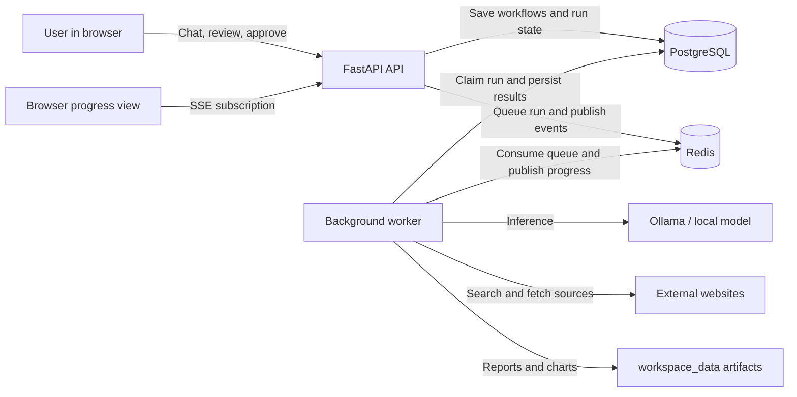

# AgentFlow

**A local-first multi-agent workbench for technology research.**

AgentFlow turns a research question into a workflow you can review, edit, approve, run, and inspect. It combines a conversational planner with a deterministic workflow executor, local LLMs through Ollama, source collection, and structured research artifacts.

> **Project status:** active personal-project prototype. The current focus is making technology-research runs reliable, traceable, and useful on local hardware. It is not a production-ready hosted service.

## Contents

- [Why AgentFlow](#why-agentflow)
- [What it does](#what-it-does)
- [How it works](#how-it-works)
- [Technology](#technology)
- [Run locally](#run-locally)
- [Run with Docker Compose](#run-with-docker-compose)
- [Verify the installation](#verify-the-installation)
- [Repository layout](#repository-layout)
- [Current scope and limitations](#current-scope-and-limitations)
- [Contributing](#contributing)
- [Security](#security)

## Why AgentFlow

Technology research often involves repeating the same work: discovering sources, checking evidence, synthesizing findings, comparing options, and writing a report. AgentFlow explores how multi-agent workflows can make that process easier to inspect and reuse while keeping the user in control.

The initial audience is technology researchers, developers, students, and technical teams who want to automate research without hiding the steps behind a single opaque answer. Local model execution can reduce model-service costs and keep prompts on the user's machine, with a trade-off: speed and answer quality depend on the local model and available hardware.

## What it does

- **Plan in chat:** describe a technology-research task and receive a proposed workflow; clarify or edit it before execution.
- **Keep approval in the loop:** review and approve a workflow before its run begins.
- **Execute dependency-aware workflows:** tasks are ordered by their dependencies; the current dispatcher runs one ready task at a time, so parallel task execution is not implemented yet.
- **Use role-specific agents and tools:** research, synthesis, reporting, and chart work are assigned to agents with authorized tools.
- **Follow progress:** inspect task status and run events while work is executing.
- **Keep results:** review research outputs and download generated artifacts such as Markdown reports and charts.
- **Run locally:** use Ollama-compatible local chat models; the default model is `qwen3:8b`.
- **Manage personal work:** sign in, create conversations, and manage workflows and runs associated with the user.

## How it works

AgentFlow is a modular monolith with separate API and background-worker processes. It has two main phases:

1. **Build:** the Supervisor discusses the request, proposes a workflow, and waits for user approval.
2. **Execute:** a background worker claims the approved run. A code-based dispatcher schedules ready tasks; each assigned agent can call its authorized tools as needed. The browser observes progress through server-sent events (SSE).



| Component | Responsibility |
| --- | --- |
| React frontend | Chat, workflow review, run progress, and result/artifact views |
| FastAPI modular monolith | Authentication, conversations, workflows, runs, catalog, and API contracts |
| Supervisor and LangGraph | Build-phase conversation and execution graph |
| Background worker | Consume queued runs and execute task agents outside the HTTP request |
| PostgreSQL | Users, conversations, workflows, run state, and durable event/result metadata |
| Redis | Run queue and realtime event distribution |
| Local artifact storage | Generated reports, charts, and downloadable files under `workspace_data/` |
| Ollama | Local LLM inference; model files are managed separately by Ollama |

MongoDB and Mongo Express also start with the Compose stack for development experiments. Application-level MongoDB persistence is disabled, and the current run-persistence path does not require MongoDB.

## Technology

- **Backend:** Python 3.11, FastAPI, SQLAlchemy, Pydantic
- **Agent runtime:** LangChain, LangGraph, Ollama
- **Frontend:** React 18, Vite
- **Persistence and coordination:** PostgreSQL, Redis; local filesystem for artifacts
- **Crawler:** static-first fetching with optional Playwright/Chromium fallback
- **Development and CI:** Docker Compose, GitHub Actions, `unittest`, ESLint, Vite build

## Run locally

The recommended development setup runs PostgreSQL and Redis in Docker, with Ollama, the API, worker, and frontend running as local processes. This lets the backend reach Ollama at `localhost:11434` without container networking configuration.

### Prerequisites

- Windows, macOS, or Linux
- Python 3.11
- Node.js and npm (Node.js 20+ recommended)
- Docker Desktop or Docker Engine with Compose v2
- [Ollama](https://ollama.com/download) with at least one supported chat model

### 1. Get the code and prepare configuration

From PowerShell:

```powershell
git clone https://github.com/TrungHocCode/agentflow.git
cd agentflow
Copy-Item .env.example .env
```

Edit `.env` and replace `AUTH_SIGNING_SECRET` with a unique random value before starting the application. Keep `.env` private; do not commit it.

Create and activate the Python environment, then install the backend dependencies:

```powershell
py -3.11 -m venv .venv
.\.venv\Scripts\Activate.ps1
python -m pip install --upgrade pip
python -m pip install -r requirements.txt
```

If PowerShell blocks environment activation, use the Python executable directly at `.venv\Scripts\python.exe`.

### 2. Start PostgreSQL and Redis

The sample configuration expects PostgreSQL on port `5433` and Redis on `6379`:

```powershell
docker compose up -d postgres redis
```

Apply database migrations and seed the default catalog:

```powershell
python backend/app/db/init_db.py
```

### 3. Start Ollama and download a model

Start the Ollama application or run `ollama serve` in another terminal, then pull the default model:

```powershell
ollama pull qwen3:8b
ollama list
```

AgentFlow defaults to `http://localhost:11434`. The UI also includes `llama3:8b` and `gemma2:latest`; pull whichever model you intend to use before selecting it. The actual model tags must match the names available from your local Ollama instance.

### 4. Start the API

From the repository root, in a new PowerShell terminal with the virtual environment activated:

```powershell
$env:PYTHONPATH = (Join-Path (Get-Location) "backend")
python -m uvicorn app.main:app --reload --host 127.0.0.1 --port 8000
```

The interactive API documentation is available at <http://localhost:8000/docs>.

### 5. Start the background worker

Run the worker in a separate terminal. Keep it running while testing workflow execution; the API queues long-running work but does not execute it inside the request handler.

```powershell
$env:PYTHONPATH = (Join-Path (Get-Location) "backend")
python -m app.workers.run_worker
```

You should see a log indicating that the AgentFlow execution worker started.

### 6. Start the frontend

In another terminal:

```powershell
cd frontend
npm ci
npm run dev
```

Open <http://localhost:5173>, register or sign in, create a research workflow in chat, review and approve it, then follow the run in the execution view. Vite proxies `/api` requests to the backend at `http://localhost:8000`.

The crawler tries static HTTP fetching first. In automatic mode, it uses Chromium only when the extracted content is poor or the page appears to need client-side rendering. For local browser-based fallback, install Chromium once:

```powershell
python -m playwright install chromium
```

Static fetching can work without browser fallback. Browser rendering is bounded and does not bypass authentication, CAPTCHAs, or anti-bot protections. The browser settings below are read by the worker process:

| Environment variable | Default | Purpose |
| --- | ---: | --- |
| `AGENTFLOW_CRAWLER_BROWSER_ENABLED` | `true` | Enable or disable browser fallback |
| `AGENTFLOW_CRAWLER_BROWSER_TIMEOUT_MS` | `18000` | Maximum page-navigation time |
| `AGENTFLOW_CRAWLER_BROWSER_SETTLE_MS` | `600` | Brief wait for client-rendered content |
| `AGENTFLOW_CRAWLER_BROWSER_MAX_CONCURRENCY` | `1` | Maximum simultaneous browser pages per worker |
| `AGENTFLOW_CRAWLER_BROWSER_SLOT_TIMEOUT_SECONDS` | `2` | Maximum wait for an available browser slot |

## Run with Docker Compose

The Compose stack includes the frontend, API, worker, PostgreSQL, Redis, database initialization, and MongoDB/Mongo Express development services:

```powershell
Copy-Item .env.example .env
# Set a unique AUTH_SIGNING_SECRET in .env before starting.
docker compose up --build
```

The frontend is served at <http://localhost:5173>, the API at <http://localhost:8000>, and Mongo Express at <http://localhost:8081>.

**Ollama is not included in the Compose stack.** For model-backed execution, the API and worker containers must be able to reach your Ollama host. The current Compose configuration does not set a host Ollama URL; the simplest working setup is the local-process workflow above. If you containerize the API and worker, configure `OLLAMA_BASE_URL` to a host-reachable Ollama address and make sure Ollama accepts connections from Docker.

## Verify the installation

Run the backend unit tests from the repository root:

```powershell
python -m unittest discover tests/
```

Check frontend code and create a production build:

```powershell
cd frontend
npm run lint
npm run build
```

The CI workflow runs database migrations, backend tests, Python compilation, frontend lint, and frontend build on pull requests to `dev` and `main`.

## Repository layout

```text
agentflow/
├── backend/
│   └── app/
│       ├── api/              # FastAPI routes and dependency wiring
│       ├── execution/        # Supervisor, agents, LangGraph, tools, and state
│       ├── infrastructure/   # PostgreSQL, Redis, artifact adapters
│       ├── modules/          # Identity, conversations, workflows, runs, results
│       └── workers/          # Background run worker
├── frontend/                 # React + Vite application
├── tests/                    # Backend unit and integration tests
├── workspace_data/           # Local generated artifacts (not source code)
├── docker-compose.yml
└── requirements.txt
```

## Current scope and limitations

- The product focus is **technology research automation**, not a general-purpose business automation platform.
- Workflow scheduling is planned for a later phase and is not currently available.
- Web research depends on external sites; sources may be unavailable, block requests, or return incomplete content.
- Local model speed and structured-output quality vary with model, quantization, context size, and CPU/GPU resources. Multi-agent runs can take substantially longer than a single chat response.
- A successful task/tool status does not by itself guarantee that research covered every requested subject. Review source coverage and citations before relying on a report.
- The project targets local development and a small number of users. Production deployment still requires additional operational hardening, secure secret management, TLS, backups, and load testing.

## Contributing

Contributions and focused bug reports are welcome. Before changing code, review [AGENTS.md](AGENTS.md) for the repository's architecture, coding, testing, and Git workflow conventions. For a code change, run the relevant tests and checks described above and open a pull request targeting `dev`.

## Security

Do not commit credentials, access tokens, model-provider keys, or real user data. Use a strong `AUTH_SIGNING_SECRET` outside disposable local development. Do not expose the development server or Ollama endpoint to an untrusted network; production use requires appropriate authentication, TLS, network controls, and secret management.
