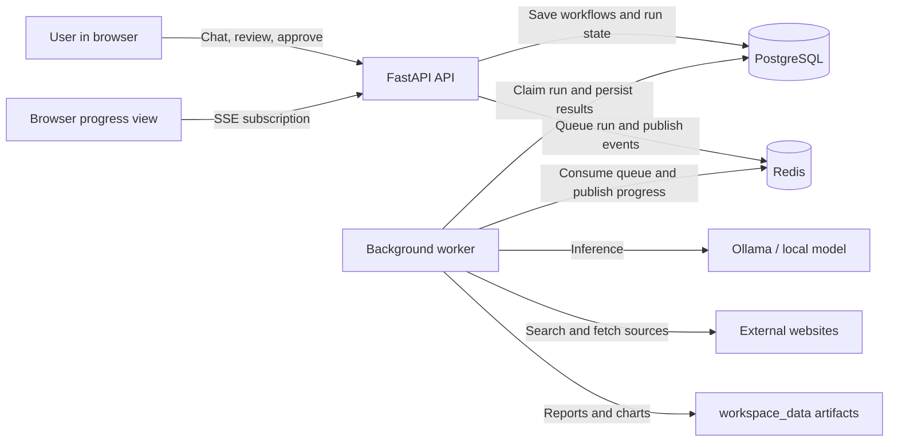

# AgentFlow

**A local-first multi-agent platform evolving toward evidence-backed competitive intelligence.**

AgentFlow's product direction is to help founders and product teams understand how competitors' products change, compare those changes with their own product, and identify relevant opportunities and risks. Its existing foundation combines a conversational planner, user-approved workflows, a deterministic execution engine, local LLMs through Ollama, source collection, and downloadable research artifacts.

> **Project status:** active personal-project prototype in a domain refactor. The workflow/research foundation exists; product profiles, cross-run product history, change detection and competitive briefs described below are planned capabilities, not available end-to-end features. AgentFlow is not a production-ready hosted service.

## Contents

- [Why AgentFlow](#why-agentflow)
- [Competitive intelligence: the target experience](#competitive-intelligence-the-target-experience)
- [Agent roles](#agent-roles)
- [What it does](#what-it-does)
- [How it works](#how-it-works)
- [Technology](#technology)
- [Run locally](#run-locally)
- [Run with Docker Compose](#run-with-docker-compose)
- [Verify the installation](#verify-the-installation)
- [Evaluate research runs](#evaluate-research-runs)
- [Repository layout](#repository-layout)
- [Current scope and limitations](#current-scope-and-limitations)
- [Contributing](#contributing)
- [Security](#security)

## Why AgentFlow

Product teams repeatedly check competitor pricing pages, feature documentation, integrations and release notes. Detecting an edit is only the beginning: they also need to establish what changed, whether the evidence supports it, and why it matters to their customers.

AgentFlow targets founders, product managers and small teams. The intended output is a traceable competitive brief, not another copy of crawled text or an absolute claim that one product is "better." Comparisons need explicit criteria, customer segments, observation dates and evidence.

Local inference avoids a required per-token cloud-model bill and keeps model processing on the configured host. It does not mean zero operating cost or fully offline research: websites are still external, and speed and quality depend on hardware, model size, quantization and context. Evidence collection must not disclose private product profiles or strategy through search queries.

## Competitive intelligence: the target experience

The following is the planned manual MVP, not a walkthrough of the current UI:

1. Create an own-product profile and competitor profiles, including target users, features, pricing and approved public sources.
2. Review the comparison goal, criteria, source scope and execution budget before approving a workflow.
3. Capture a first baseline. An initial capture alone cannot establish that a product improved.
4. Run again to compare compatible source snapshots and investigate meaningful additions, removals or modifications.
5. Verify important claims, compare them with the user's product, and produce a downloadable brief with citations, limitations and advisory actions.

Product history will be immutable rather than overwritten. Publication, launch, effective, observation and fetch dates are distinct; unknown dates stay unknown. A failed fetch is not a removed feature. A change is not automatically an improvement.

| Capability | Availability |
| --- | --- |
| Authentication, conversations and workflow review | Existing foundation |
| Queued runs, authorized agent tools, SSE progress and artifacts | Existing foundation |
| Own-product and competitor profiles with historical versions | Planned |
| Approved watchlists, durable snapshots and cross-run baselines | Planned |
| Change detection, bounded investigation and evidence verification | Planned |
| Product comparison and structured competitive briefs | Planned |
| Scheduled monitoring | Deferred until the manual flow is validated |

## Agent roles

These are target responsibilities, not six agents already wired into the application:

| Role | Responsibility | Proposed tool capabilities |
| --- | --- | --- |
| Supervisor / Coordinator | Clarify goals, propose a plan, resolve evidence gaps within approved scope | Read profiles, product history, source catalog and investigation state |
| Source Researcher | Find and collect approved public evidence | Search, single/batch crawl, HTTP fetch, bounded snapshot reads |
| Product Analyst | Extract product facts and interpret detected changes | Read profiles/history, change candidates, snapshots and evidence |
| Evidence Verifier | Check support, contradictions, dates and conditions | Read evidence/snapshots; scoped additional search or collection |
| Competitive Analyst | Assess gaps, strengths and impact for the target customer | Read verified findings, product profiles/history and comparison criteria |
| Report Agent | Present the analysis without inventing new facts | Read comparison results/evidence; deterministic report and conditional chart rendering |

The backend owns permissions, storage, diffs, arithmetic, validation, budgets and task scheduling. Agents cannot grant themselves tool access. Not every run invokes every role; missing evidence can trigger bounded follow-up investigation, while no-change runs may need no analytical LLM call.

## What it does

- **Plan in chat:** describe a research task and receive a proposed workflow; clarify or edit it before execution. This is the existing generic flow, not yet a product-profile setup flow.
- **Keep approval in the loop:** review and approve a workflow before its run begins.
- **Execute dependency-aware workflows:** tasks are ordered by their dependencies; the current dispatcher runs one ready task at a time, so parallel task execution is not implemented yet.
- **Use role-specific agents and tools:** research, synthesis, reporting, and chart work are assigned to agents with authorized tools.
- **Follow progress:** inspect task status and run events while work is executing.
- **Keep results:** review research outputs and download generated artifacts such as Markdown reports and charts.
- **Route inference by role:** model profiles are configured server-side; users do not select a model in the UI. Repository defaults and local operator overrides can differ.
- **Manage personal work:** sign in, create conversations, and manage workflows and runs associated with the user.

## How it works

AgentFlow is a modular monolith with separate API and background-worker processes. It has two main phases:

1. **Build:** the Supervisor discusses the request, proposes a workflow, and waits for user approval.
2. **Execute:** a background worker claims the approved run. A code-based dispatcher schedules ready tasks; each assigned agent can call its authorized tools as needed. The browser observes progress through server-sent events (SSE).


```mermaid
flowchart LR
    User[User in browser] -->|Chat, review, approve| API[FastAPI API]
    API -->|Save workflows and run state| PG[(PostgreSQL)]
    API -->|Queue run and publish events| Redis[(Redis)]
    Browser[Browser progress view] -->|SSE subscription| API
    Worker[Background worker] -->|Claim run and persist results| PG
    Worker -->|Consume queue and publish progress| Redis
    Worker -->|Inference| Ollama[Ollama / local model]
    Worker -->|Search and fetch sources| Web[External websites]
    Worker -->|Reports and charts| Files[workspace_data artifacts]
```

| Component | Responsibility |
| --- | --- |
| React frontend | Chat, workflow review, run progress, and result/artifact views |
| FastAPI modular monolith | Authentication, conversations, workflows, runs, catalog, and API contracts |
| Supervisor and LangGraph | Build-phase conversation and execution graph |
| Background worker | Consume queued runs and execute task agents outside the HTTP request |
| PostgreSQL | Users, conversations, workflows, run state, and durable event/result metadata |
| Redis | Run queue and realtime event distribution |
| Local artifact storage | Generated reports, charts, and downloadable files under `workspace_data/` |
| Ollama | Local LLM inference; model files are managed separately by Ollama |

MongoDB and Mongo Express also start with the Compose stack for development experiments. Application-level MongoDB persistence is disabled, and the current run-persistence path does not require MongoDB.

## Technology

- **Backend:** Python 3.11, FastAPI, SQLAlchemy, Pydantic
- **Agent runtime:** LangChain, LangGraph, Ollama
- **Frontend:** React 18, Vite
- **Persistence and coordination:** PostgreSQL, Redis; local filesystem for artifacts
- **Crawler:** static-first fetching with optional Playwright/Chromium fallback
- **Development and CI:** Docker Compose, GitHub Actions, `unittest`, ESLint, Vite build

## Run locally

The recommended development setup runs PostgreSQL and Redis in Docker, with Ollama, the API, worker, and frontend running as local processes. This lets the backend reach Ollama at `localhost:11434` without container networking configuration.

### Prerequisites

- Windows, macOS, or Linux
- Python 3.11
- Node.js and npm (Node.js 20+ recommended)
- Docker Desktop or Docker Engine with Compose v2
- [Ollama](https://ollama.com/download) with at least one supported chat model

### 1. Get the code and prepare configuration

From PowerShell:

```powershell
git clone https://github.com/TrungHocCode/agentflow.git
cd agentflow
Copy-Item .env.example .env
```

Edit `.env` and replace `AUTH_SIGNING_SECRET` with a unique random value before starting the application. Keep `.env` private; do not commit it.

Create and activate the Python environment, then install the backend dependencies:

```powershell
py -3.11 -m venv .venv
.\.venv\Scripts\Activate.ps1
python -m pip install --upgrade pip
python -m pip install -r requirements.txt
```

If PowerShell blocks environment activation, use the Python executable directly at `.venv\Scripts\python.exe`.

### 2. Start PostgreSQL and Redis

The sample configuration expects PostgreSQL on port `5433` and Redis on `6379`:

```powershell
docker compose up -d postgres redis
```

Apply database migrations and seed the default catalog:

```powershell
python backend/app/db/init_db.py
```

### 3. Start Ollama and download a model

Start the Ollama application or run `ollama serve` in another terminal, then pull the models named in your configuration. For the repository defaults:

```powershell
ollama pull qwen3:0.6b
ollama pull qwen3:8b
ollama list
```

AgentFlow defaults to `http://localhost:11434`. Model routing is configured on the backend with `LLM_CHAT_MODEL`, `LLM_PLANNER_MODEL`, and `LLM_WORKER_MODEL` in `.env`; changing these values does not add a model picker to the user interface. The default router sends obvious short questions and small-talk to the chat profile, routes research/workflow requests to the planner profile, and assigns the worker profile to tool-using tasks. Ambiguous requests default to planning.

### 4. Start the API

From the repository root, in a new PowerShell terminal with the virtual environment activated:

```powershell
$env:PYTHONPATH = (Join-Path (Get-Location) "backend")
python -m uvicorn app.main:app --reload --host 127.0.0.1 --port 8000
```

The interactive API documentation is available at <http://localhost:8000/docs>.

### 5. Start the background worker

Run the worker in a separate terminal. Keep it running while testing workflow execution; the API queues long-running work but does not execute it inside the request handler.

```powershell
$env:PYTHONPATH = (Join-Path (Get-Location) "backend")
python -m app.workers.run_worker
```

You should see a log indicating that the AgentFlow execution worker started.

### 6. Start the frontend

In another terminal:

```powershell
cd frontend
npm ci
npm run dev
```

Open <http://localhost:5173>, register or sign in, create a research workflow in chat, review and approve it, then follow the run in the execution view. Vite proxies `/api` requests to the backend at `http://localhost:8000`.

The crawler tries static HTTP fetching first. In automatic mode, it uses Chromium only when the extracted content is poor or the page appears to need client-side rendering. For local browser-based fallback, install Chromium once:

```powershell
python -m playwright install chromium
```

Static fetching can work without browser fallback. Browser rendering is bounded and does not bypass authentication, CAPTCHAs, or anti-bot protections. The browser settings below are read by the worker process:

| Environment variable | Default | Purpose |
| --- | ---: | --- |
| `AGENTFLOW_CRAWLER_BROWSER_ENABLED` | `true` | Enable or disable browser fallback |
| `AGENTFLOW_CRAWLER_BROWSER_TIMEOUT_MS` | `18000` | Maximum page-navigation time |
| `AGENTFLOW_CRAWLER_BROWSER_SETTLE_MS` | `600` | Brief wait for client-rendered content |
| `AGENTFLOW_CRAWLER_BROWSER_MAX_CONCURRENCY` | `1` | Maximum simultaneous browser pages per worker |
| `AGENTFLOW_CRAWLER_BROWSER_SLOT_TIMEOUT_SECONDS` | `2` | Maximum wait for an available browser slot |

## Run with Docker Compose

The Compose stack includes the frontend, API, worker, PostgreSQL, Redis, database initialization, and MongoDB/Mongo Express development services:

```powershell
Copy-Item .env.example .env
# Set a unique AUTH_SIGNING_SECRET in .env before starting.
docker compose up --build
```

The frontend is served at <http://localhost:5173>, the API at <http://localhost:8000>, and Mongo Express at <http://localhost:8081>.

**Ollama is not included in the Compose stack.** For model-backed execution, the API and worker containers must be able to reach your Ollama host. The simplest working setup is the local-process workflow above. If you use the API and worker containers, set `OLLAMA_BASE_URL` in `.env` to a host-reachable Ollama address and make sure Ollama accepts connections from Docker; Compose forwards that URL and the three model-profile settings to both services.

## Verify the installation

Run the backend unit tests from the repository root:

```powershell
python scripts/run_tests.py unit
```

Check frontend code and create a production build:

```powershell
cd frontend
npm run lint
npm run build
```

The CI workflow separates isolated unit tests, real PostgreSQL/Redis migration and adapter integration tests,
and frontend lint/build on pull requests to `dev` and `main`. See [integration test setup](integration_tests/README.md)
for disposable local test services. The integration suite refuses development database targets and test-auth bypass.

## Evaluate research runs

Use the versioned [evaluation cases and metrics](evaluation/README.md) to compare research quality and runtime behavior across changes. The record tool saves one structured JSON file per run under ignored `workspace_data/evaluations/`, then summarizes latency, throughput, source/citation coverage, and outcomes:

```powershell
python scripts/evaluation_runs.py new --case-id llm-benchmark-comparison --model qwen3:8b --quantization Q4_K_M
```

The case chooses live or replay mode by default. Fill in measurements and evidence sources, mark the run's execution status/verdict, validate it, and generate the aggregate report as described in the evaluation guide.

## Repository layout

```text
agentflow/
├── backend/
│   └── app/
│       ├── api/              # FastAPI routes and dependency wiring
│       ├── execution/        # Supervisor, agents, LangGraph, tools, and state
│       ├── infrastructure/   # PostgreSQL, Redis, artifact adapters
│       ├── modules/          # Identity, conversations, workflows, runs, results
│       └── workers/          # Background run worker
├── frontend/                 # React + Vite application
├── tests/                    # Backend unit tests (mocked dependencies)
├── integration_tests/        # Dedicated real PostgreSQL/Redis tests
├── workspace_data/           # Local generated artifacts (not source code)
├── docker-compose.yml
└── requirements.txt
```

## Current scope and limitations

- The product direction is **competitive product intelligence**. Current application screens still expose the generic research/workflow foundation; the domain refactor is not complete.
- Initial scope is public, approved pricing, feature, integration and release-note sources. Authenticated/paywalled collection, anti-bot bypass and autonomous external actions are out of scope.
- Comparison quality requires an accurate own-product profile and explicit criteria. Do not infer a winner from incomplete data, page edits or incompatible measurements.
- Workflow scheduling is planned for a later phase and is not currently available.
- Web research depends on external sites; sources may be unavailable, block requests, or return incomplete content.
- Local model speed and structured-output quality vary with model, quantization, context size, and CPU/GPU resources. Multi-agent runs can take substantially longer than a single chat response.
- A successful task/tool status does not by itself guarantee that research covered every requested subject. Review source coverage and citations before relying on a report.
- The project targets local development and a small number of users. Production deployment still requires additional operational hardening, secure secret management, TLS, backups, and load testing.

## Contributing

Contributions and focused bug reports are welcome. Before changing code, review [AGENTS.md](AGENTS.md) for the repository's architecture, coding, testing, and Git workflow conventions. For a code change, run the relevant tests and checks described above and open a pull request targeting `dev`.

## Security

Do not commit credentials, access tokens, model-provider keys, or real user data. Use a strong `AUTH_SIGNING_SECRET` outside disposable local development. Do not expose the development server or Ollama endpoint to an untrusted network; production use requires appropriate authentication, TLS, network controls, and secret management.
